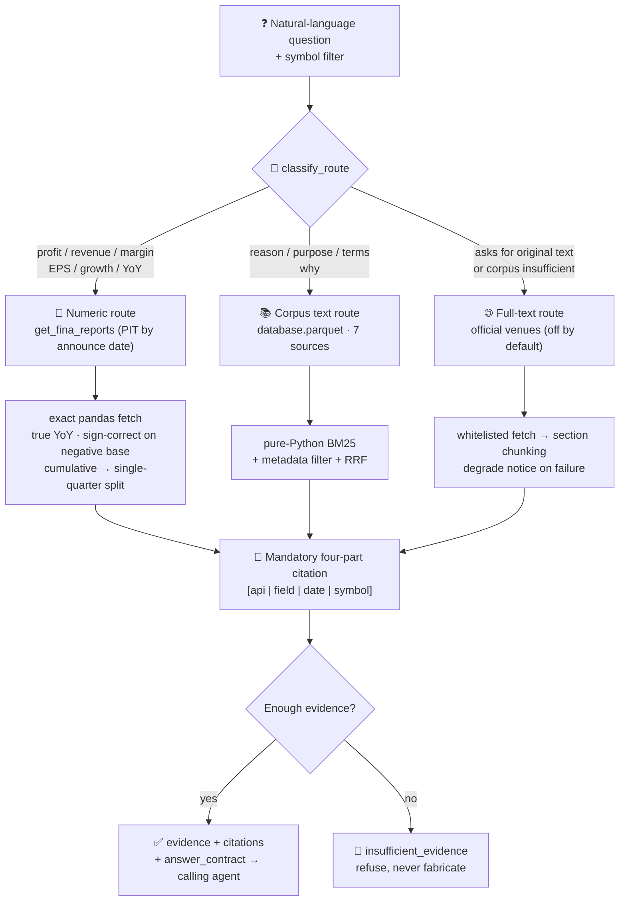

# 📑 Financial Filing RAG Q&A

[简体中文](README.md) | **English**

> Ask a question about one (or several) A-share companies' **financial reports and filings**, and get an answer that is
> **cited to the official source, checkable, and refuses to fabricate**.
> Numbers are computed exactly, text answers carry provenance, out-of-corpus questions are declined —
> **it only restates and computes public disclosure; not investment advice.**

> Project status: QUANTSKILLS **Community Project** — not reviewed, certified or endorsed by QuantSkills. Task ID `#42`.

<p align="center">
  
  
  
  
  
  
  
  
</p>

---

## 📖 What this is

RAG (Retrieval-Augmented Generation) in plain terms: **find the relevant official text first, then answer from it and cite the source.**

The key judgement here is that **not every question should go through retrieval.** Asking an LLM to "retrieve" a net-profit
figure and then do mental arithmetic on it is a primary source of hallucination. Hence **three-way routing**: compute numbers
exactly, retrieve only for text, fetch web pages only when the original wording is demanded.

| Question type | How it answers | Example |
|---|---|---|
| **Numeric** | PIT financials → **exact pandas computation** | "CATL 2024Q4 net-profit **growth**?" → **+15.01%** (arithmetic shown in the citation) |
| **Textual** | BM25 over the official-text corpus | "**Why** did Zijin cut its Dun'an stake?" → "operational needs of its own" (four-part citation) |
| **Not covered** | **Refuses** | "Who is the chairman?" → `insufficient_evidence`, no fabrication |

**Explicitly does NOT**: value companies, give buy/sell advice, or predict prices.

---

## 🧭 Three-way routing ("numbers never enter the retrieval layer" is the anti-hallucination red line)



### Route contracts

| Route | Trigger | Source | Key discipline |
|---|---|---|---|
| ① **Numeric** | profit / revenue / margin / EPS / **growth / YoY** | `get_fina_reports` (PIT by announce date) | Never enters retrieval, never model mental math; PIT prefers the **original filing** over later restatements |
| ② **Corpus text** | reason / purpose / terms / why | `database.parquet` (7-source doc corpus) | Pure-Python BM25, **zero third-party deps, zero network**; direct-read for small material |
| ③ **Full text** | asks for "original text / clause", or corpus insufficient | CNINFO / exchanges / HKEX / EDGAR | **Official venues only, never paid research**; off by default, degrades explicitly on failure |

---

## 🔖 Citation discipline: checkability is the floor

Every conclusion carries an **official four-part citation**, formatted per source:

| Source | Citation form | Example |
|---|---|---|
| PandaData structured field | `[api\|field\|date\|symbol]` | `[get_repurchase\|purpose\|20250730\|002011.SZ]` |
| Numeric route, YoY | citation **includes the arithmetic** | `[get_fina_reports\|is_n_income_attr_p yoy\|20260310\|300750.SZ] (2024q4=5.074e+10 ÷ 2023q4=4.412e+10)` |
| Official web full text | `[url\|title\|date\|fetched]` | — |

**No finished answer is generated by default**: it returns `evidence / numeric / citations` plus an `answer_contract`
("answer point by point from the evidence, attach a cite to every claim, state explicitly whatever is not covered"),
and the calling agent writes the prose. Set `config.llm` to generate internally.

---

## 🧪 Cross-company / cross-period questions

When several companies or periods are asked about, each is computed exactly — **never silently answering only one**:

```python
n = qa.answer_numeric("CATL and BYD 2024q4 net profit", cache,
                      {"symbols": ["300750.SZ", "002594.SZ"]})
n["multi"]   # True
n["items"]   # [{symbol:300750.SZ, value:…, cite:…}, {symbol:002594.SZ, value:…, cite:…}]
```

If a requested symbol is absent from the corpus, it is **named explicitly** in `missing_symbols` and in the answer
contract, rather than quietly dropped — an extension of the refusal discipline.

---

## 🚀 Quick start

```bash
pip install --upgrade panda_data pyarrow
export PANDA_USERNAME=<phone>; export PANDA_PASSWORD=<password>   # or ~/.pandadata/pandadata.env

# Numeric growth question
python 开发产物/scripts/build.py --question "宁德时代2024q4归母净利润增速" --symbols 300750.SZ
# Textual "why" question
python 开发产物/scripts/build.py --question "紫金矿业为什么减持盾安环境" --symbols 002011.SZ
# Build the corpus → database.parquet
python 开发产物/scripts/build.py --symbols 002011.SZ 300750.SZ --backfill 20240101 20260711
# Fully offline self-test (all green without panda_data)
python 开发产物/scripts/test.py
```

---

## 📂 Layout

```
开发产物/  (development)
  scripts/
    qa.py          3-way routing + citation discipline + refusal + cross-company/period numerics
    retrieve.py    retrieval layer (pure-Python BM25 / HashEmbedder / RRF, zero IO, zero network)
    ingest.py      PandaData 7 text sources → doc corpus + numeric cache (PIT)
    webfetch.py    on-demand official full text (whitelist / rate limit / degrade; off by default)
    build.py       run / validate_input / backfill / maintain_daily / save_corpus
    render.py      single-quarter split + SVG bar chart (green up, red down)
    test.py        fully offline fixtures (23 cases)
  references/
    api_guide.md        interfaces, field semantics, live-tested findings
    quality_evidence.md real-ticker verification, coverage, defect fixes, honest boundaries
    golden_qa.json      golden Q&A set (regression, all reproducible)
  SKILL.md / skill.json
生产产物/  (production)
  database.parquet             doc corpus (bundled sample: 154 docs / 11 tickers)
  sample_quarterly_688347.html single-quarter decomposition chart sample
  SKILL.md                     corpus read rules
```

---

## 📊 Corpus sources (7 types)

| doc_type | Interface | Content |
|---|---|---|
| `lhb` | `get_lhb_list` | Reason for appearing on the dragon-tiger list |
| `audit` | `get_audit_opinion` | Audit opinion type (distinguishes "covered, clean" from "genuinely no data") |
| `shareholder_change` | `get_stock_shareholder_change` | Stake increase/decrease reasons (with direction) |
| `repurchase` | `get_repurchase` | Buyback purpose (up to 573 chars) |
| `restricted` | `get_restricted_list` | Lockup-release batches and reasons (aggregated per batch) |
| `forecast` | `get_fina_forecast` | Earnings pre-announcement direction |
| `status_change` | `get_stock_status_change` | ST / delisting risk / restructuring notes |

> The interfaces named in the original task spec — `get_investor_brief_qa`, `get_stock_litigation_arbitration`,
> `get_stock_material_contract` — **do not exist** in the latest PandaData interface documentation (187 methods),
> so the corpus was redesigned around the seven fields actually available.

---

## ⚖️ Data & disclaimer

- **Source**: PandaData (credentials via env vars or `~/.pandadata/pandadata.env`, **never hard-coded**) + official disclosure venues (secondary full-text source).
- **Official venues only; no paid research (Wind / Choice)** — copyright + community rule §3. The full-text route is off by default.
- **Known limits**: the bundled corpus covers a small universe (11 tickers); re-run `backfill` for your own universe. The HK/US full-text channel needs a live-tested entry point.
- **Refusal has two tiers**: hard (symbol not in corpus, engine-guaranteed) / topic-not-covered (declared by the calling agent per contract) — see `quality_evidence.md`.

> **Community Project, not reviewed / certified / endorsed by QuantSkills. Research and educational example only;
> not investment advice, no return promises.** The Q&A only restates and computes public disclosure; verify against the original filing.

License: **GPL-3.0-only**
