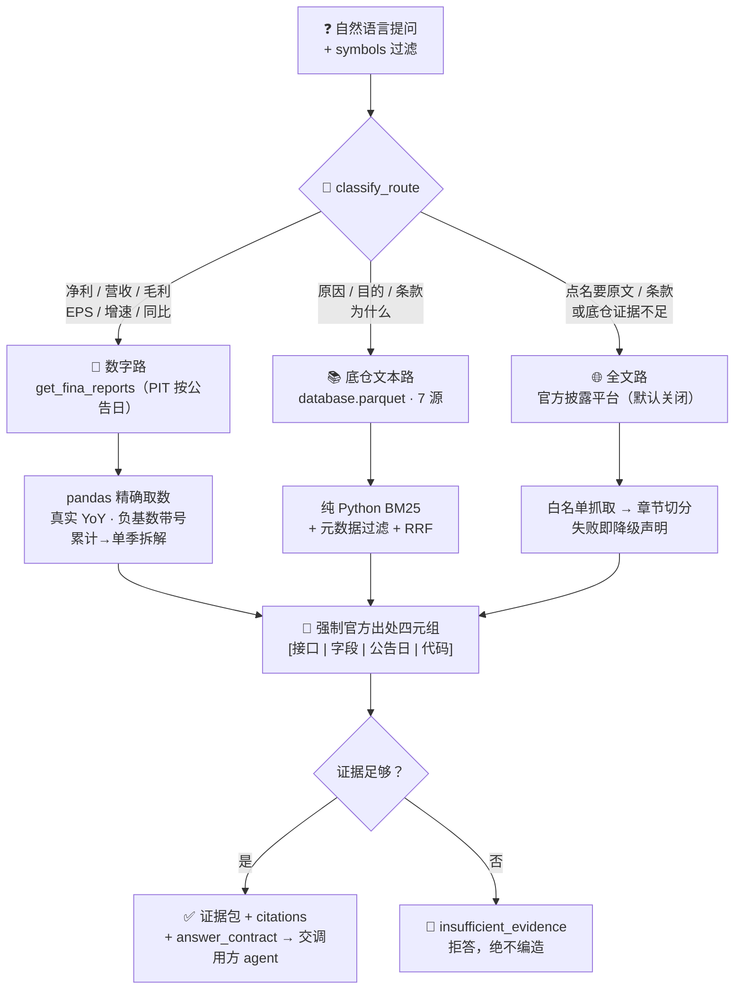

# 📑 财报公告 RAG 问答系统

**简体中文** | [English](README.en.md)

> 就一家（或几家）A 股公司的**财报 / 公告**提问，给出**带官方引用、可核对、拒绝编造**的回答。
> 数字精确算、文字带出处、语料不覆盖就**拒答**——仅复述与计算公开披露。

> 项目状态：QUANTSKILLS **社区项目（Community Project）**，未经官方审核 / 认证 / 背书。任务编号 `#42`。

<p align="center">
  
  
  
  
  
  
  
  
</p>

---

## 📖 这是什么

RAG（Retrieval-Augmented Generation，检索增强生成）说人话就是：**先查到相关官方原文，再照着原文回答并注明出处**。

但本 skill 的关键判断是——**不是所有问题都该走检索**。让大模型去"检索"一个净利润数字再心算同比，是幻觉的主要来源。所以这里用**三路路由**分而治之：数字精确算、文字才检索、原文才抓网页。

| 问什么 | 怎么答 | 例子 |
|---|---|---|
| **数字类** | 查 PIT 财报 → pandas **精确计算** | 「宁德时代 2024q4 归母净利**增速**？」→ **+15.01%**（带算式引用） |
| **文字类** | 底仓 BM25 检索官方原文 | 「紫金矿业**为什么**减持盾安环境？」→ "自身经营需要"（附出处四元组） |
| **不覆盖** | **拒答** | 「这家公司董事长是谁？」→ `insufficient_evidence`，不编造 |

**明确不做**：不做估值、不给买卖建议、不预测股价。

---

## 🧭 三路路由（「数字绝不进检索层」是防幻觉红线）



### 每条路的口径

| 路 | 触发词 | 数据来源 | 关键纪律 |
|---|---|---|---|
| ① **数字路** | 净利 / 营收 / 毛利 / EPS / **增速 / 同比** | `get_fina_reports`（PIT 按公告日） | 绝不进检索层、绝不让模型心算；PIT 取**原始公告**而非追溯重述 |
| ② **底仓文本路** | 原因 / 目的 / 条款 / 为什么 | `database.parquet`（7 源 doc 语料） | 纯 Python BM25，**零第三方依赖、零联网**；小料直读全量 |
| ③ **全文路** | 点名"原文 / 全文 / 条款"，或底仓不足 | 巨潮 / 交易所 / HKEX / EDGAR | **只抓官方披露、不抓付费研报**；默认关闭、失败即降级声明 |

---

## 🔖 引用纪律：可核对是底线

每条结论强制附**官方出处四元组**，格式随来源而变：

| 来源 | 引用格式 | 实例 |
|---|---|---|
| PandaData 结构化字段 | `[接口\|字段\|公告日\|代码]` | `[get_repurchase\|purpose\|20250730\|002011.SZ]` |
| 数字路同比 | 引用**带算式** | `[get_fina_reports\|is_n_income_attr_p yoy\|20260310\|300750.SZ]（2024q4=5.074e+10 ÷ 2023q4=4.412e+10）` |
| 官方网页全文 | `[url\|标题\|日期\|抓取时间]` | — |

**默认不生成成品答案**：返回 `evidence / numeric / citations` + `answer_contract`（"逐条基于证据作答、每个结论附 cite、未覆盖必须明说"），由调用方 agent 落笔。配了 `config.llm` 才内部生成。

---

## 🧪 跨公司 / 跨期问答

问多家公司或多个期间时，**逐个精确计算、绝不静默只答一个**：

```python
n = qa.answer_numeric("宁德时代和比亚迪 2024q4 归母净利润", cache,
                      {"symbols": ["300750.SZ", "002594.SZ"]})
n["multi"]   # True
n["items"]   # [{symbol:300750.SZ, value:…, cite:…}, {symbol:002594.SZ, value:…, cite:…}]
```

底仓里缺某只票时，会在 `missing_symbols` 与作答契约里**显式点名**，而不是悄悄省略——这是"拒答纪律"的延伸。

---

## 🚀 快速开始

```bash
pip install --upgrade panda_data pyarrow
export PANDA_USERNAME=<手机号>; export PANDA_PASSWORD=<密码>   # 或 ~/.pandadata/pandadata.env

# 数字增速问答
python 开发产物/scripts/build.py --question "宁德时代2024q4归母净利润增速" --symbols 300750.SZ
# 文本原因问答
python 开发产物/scripts/build.py --question "紫金矿业为什么减持盾安环境" --symbols 002011.SZ
# 建底仓语料 → database.parquet
python 开发产物/scripts/build.py --symbols 002011.SZ 300750.SZ --backfill 20240101 20260711
# 全离线自测（无 panda_data 也全绿）
python 开发产物/scripts/test.py
```

---

## 📂 目录

```
开发产物/
  scripts/
    qa.py          三路路由 + 引用纪律 + 拒答 + 跨公司/跨期数字问答
    retrieve.py    检索层（纯 Python BM25 / HashEmbedder / RRF，零 IO 零联网）
    ingest.py      PandaData 7 文本源 → 底仓 doc 语料 + 数字缓存（PIT）
    webfetch.py    官方披露平台全文按需（白名单/限速/降级；默认关闭）
    build.py       run / validate_input / backfill / maintain_daily / save_corpus
    render.py      单季拆解 + SVG 柱状图（正绿负红）
    test.py        全离线夹具（23 用例）
  references/
    api_guide.md        接口 + 字段口径 + 真机实测结论
    quality_evidence.md 真票核验 + 测试覆盖 + 缺陷修复 + 诚实边界
    golden_qa.json      金标问答集（回归用，全部可复现）
  SKILL.md / skill.json
生产产物/
  database.parquet             底仓 doc 语料（随包样例 154 条 / 11 票）
  sample_quarterly_688347.html 单季拆解图样例（华虹公司）
  SKILL.md                     生产底仓读取规则
```

---

## 📊 底仓语料源（7 类）

| doc_type | 来源接口 | 内容 |
|---|---|---|
| `lhb` | `get_lhb_list` | 龙虎榜上榜原因 |
| `audit` | `get_audit_opinion` | 审计意见类型（含"覆盖但无异常"与"真无数据"的区分） |
| `shareholder_change` | `get_stock_shareholder_change` | 增减持原因（含方向） |
| `repurchase` | `get_repurchase` | 回购目的（最长 573 字） |
| `restricted` | `get_restricted_list` | 解禁批次与原因（按批次聚合） |
| `forecast` | `get_fina_forecast` | 业绩预告方向 |
| `status_change` | `get_stock_status_change` | ST / 退市风险 / 重整说明 |

> 清单原案点名的 `get_investor_brief_qa` / `get_stock_litigation_arbitration` / `get_stock_material_contract`
> 在 PandaData 最新接口文档（187 方法）中**均不存在**，故按本地实际可得字段重新设计为上述 7 源。

---

## ⚖️ 数据与免责

- **数据源**：PandaData（凭证走环境变量或 `~/.pandadata/pandadata.env`，**绝不硬编码**）+ 官方披露平台（全文次级源）。
- **只抓官方披露平台，不抓研报 / Wind / Choice 等付费源**（版权 + 社区规则 §3）；全文路默认关闭。
- **已知限制**：底仓覆盖票数有限（随包样例 11 票），需按自己的股票池重跑 `backfill`；港美股全文通道需有网实测。
- **拒答分两层**：硬拒答（symbol 不在底仓，引擎保证）/ 话题不覆盖（由调用方 agent 按契约声明），见 `quality_evidence.md`。

> **Community Project，未经 QuantSkills 官方审核 / 认证 / 背书。仅量化研究与教育示例，不构成投资建议，不承诺收益。**
> 问答仅复述 / 计算公开披露，核对以官方原文为准。

License: **GPL-3.0-only**
